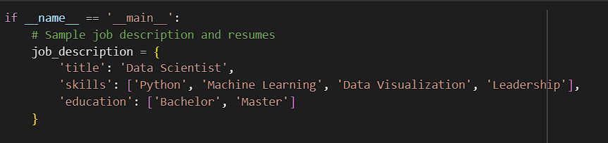

# Resume-Parsing-and-Analysis
This application aims to streamline the process of matching job descriptions with resumes by extracting relevant information such as contact details, skills, and education from resumes and calculating a similarity score to find the best match. The approach leverages natural language processing and machine learning techniques to automate and enhance the accuracy of the matching process.

## Steps to Set Up and Run the Application
- 1.**Open Google Colab:**
 - Go to Google Colab (access through your browser)
 - Click on "File" in the top-left corner, then select "New Notebook." and upload the file.
- 2.** Upload the Dataset: **
 - In the left sidebar, click on the "Files" tab.
 - Click the "Upload" button and upload all the PDF resumes provided (5 in total).
- 3.** Execute the code **

## You can Modify the Job Description (optional)
If you want to change the job description to match a different job role, you can modify the job_description dictionary in the code. Here is an example of how you can customize it:

## Functionalities
The code includes the following functionalities:
1.**Extract Text from PDF:**
- Uses pdfminer.six to extract text from PDF files.
2.**Extract Contact Information:**
- Extracts contact number and email address using regular expressions.
3.**Extract Skills:**
- Matches the skills listed in the job description with those in the resume.
4.**Extract Education:**
- Identifies educational qualifications mentioned in the resume.
5.**Extract Candidate Name:**
- Uses spaCy to extract the candidate's name from the resume text.
6.**Preprocess Text:**
- Converts text to lowercase and removes extra whitespaces.
7.**Calculate Similarity:**
- Uses CountVectorizer and cosine_similarity to calculate the similarity between the resume and the job description.
8.**Match Resume with Job:**
- Combines the extracted skills and education to match the resume with the job description and calculate a similarity score.
9.**Output Best Match:**
- Compares all resumes and outputs the best matching resume with detailed information.
